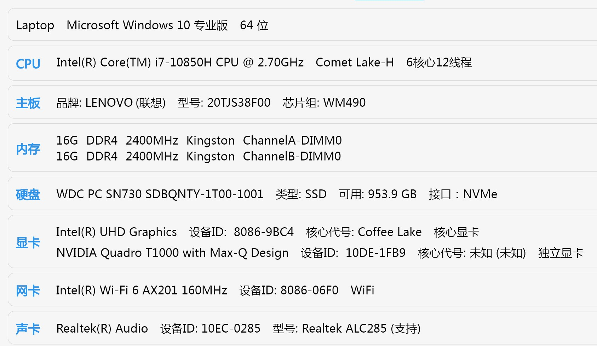

# Hackintosh-LENOVO-ThinkPad-P1-Gen-3

[EN](https://github.com/fix221/ThinkPad-P1-Gen3-Hackintosh/blob/main/README.md)

## 项目描述

本项目是为 Lenovo ThinkPad P1 Gen3 笔记本电脑设计的 Hackintosh 配置，旨在提供 macOS 系统的兼容性和稳定性。

 

## 功能特性

- 支持 macOS 最新版本
- 硬件兼容性优化
- 集成驱动和补丁

## 系统配置

### 硬件规格

- 处理器：Intel Core i7-10850H
- 内存：32GB/64GB DDR4
- 显卡：Intel UHD Graphics 630/NVIDIA Quadro T1000（需禁用）
- 存储：WD SN730(NVME)
- 无线网卡：Intel Wi-Fi 6 AX201
- 声卡：Realtek ALC285

## BIOS 配置

### 恢复默认设置

- `Config -> Display -> Graphics Devices`：**Hybrid Graphics**；
- `Config -> Display -> Total Graphics Memory`：**256MB**；

## 安装说明

1. 下载最新的 Release 版本
2. 按照[此指南](https://dortania.github.io/OpenCore-Install-Guide/installer-guide/windows-install.html)创建 USB 安装盘
3. 按照指南配置 BIOS 设置
4. 使用提供的 EFI 文件启动 macOS Recovery

## 贡献指南

欢迎提交 Issue 或 Fork 来改进本项目。

## 致谢

* [Acidanthera](https://github.com/Acidanthera)
  * OpenCorePkg 以及许多核心 kexts 和工具
* [Dortania](https://github.com/dortania) 和 OpenCore Install Guide 贡献者
* [Apple](https://apple.com)
  * macOS
* [laobamac](https://github.com/laobamac)
  * OCLP-Mod

