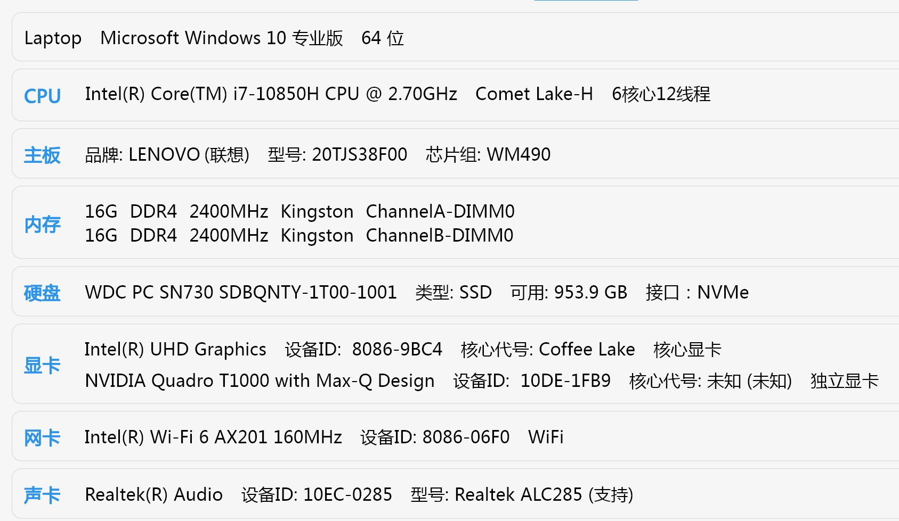

# Hackintosh-LENOVO-ThinkPad-P1-Gen-3

[CN](https://github.com/fix221/ThinkPad-P1-Gen3-Hackintosh/blob/main/README-ZH.md)

## Project Description

This project is a Hackintosh configuration designed for the Lenovo ThinkPad P1 Gen3 laptop, aiming to provide compatibility and stability for macOS.

 

## Features

- Supports the latest macOS version
- Hardware compatibility optimization
- Integrated drivers and patches

## System Configuration

### Hardware Specifications

- Processor: Intel Core i7-10850H
- Memory: 32GB/64GB DDR4
- Graphics: Intel UHD Graphics 630/NVIDIA Quadro T1000 (needs to be disabled)
- Storage: WD SN730(NVME)
- Wireless Card: Intel Wi-Fi 6 AX201
- Audio Card: Realtek ALC285

## Bios Configuration

### Reset To default

- `Config -> Display -> Graphics Devices`: **Hybrid Graphics**;
- `Config -> Display -> Total Graphics Memory`: **256MB**;

## Installation Instructions

1. Download the latest Release
2. Create USB follow [this guide](https://dortania.github.io/OpenCore-Install-Guide/installer-guide/windows-install.html)
3. Configure BIOS settings as per the guide
4. Boot macOS Recovery using the provided EFI files

## Contribution Guidelines

Feel free to submit Issues or Forks to improve this project.

## Credits

* [Acidanthera](https://github.com/Acidanthera)
  * OpenCorePkg, as well as many of the core kexts and tools
* [Dortania](https://github.com/dortania) and OpenCore Install Guide contributors
* [Apple](https://apple.com)
  * for macOS
* [laobamac](https://github.com/laobamac)
   * for OCLP-Mod

